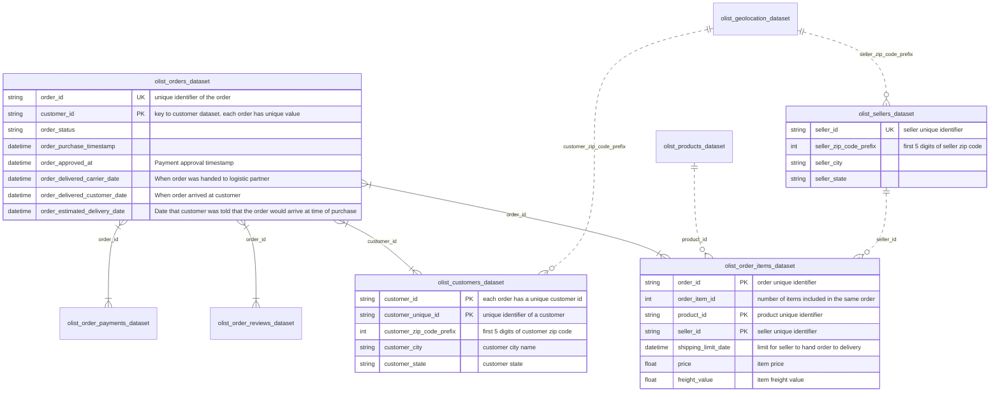

# Olist-Sales-Analysis
Analysis of publicly available sales data from Olist available on Kaggle at https://www.kaggle.com/datasets/olistbr/brazilian-ecommerce
<!-- 
Questions that are worth exploring
	Where are most of our sales coming from?
	Which products are the best/worst reviewed?
	Which products are making us the most money?
	Does the difference between estimated/actual delivery date correlate with review scores? Does it affect the odds of having a repeat customer?
	When in the year are the most sales made?
	Does the type of product sold vary across the seasons?

To Do list
-convert dates into proper datetimes so they can be analysed in data_cleaning.py
-complete temporal analysis
-->

<!--
This diagram is not of interest to stakeholders and is only for technical audience. Therefore it takes low priority and should go near the bottom
-->
## Relational diagram of raw datasets

